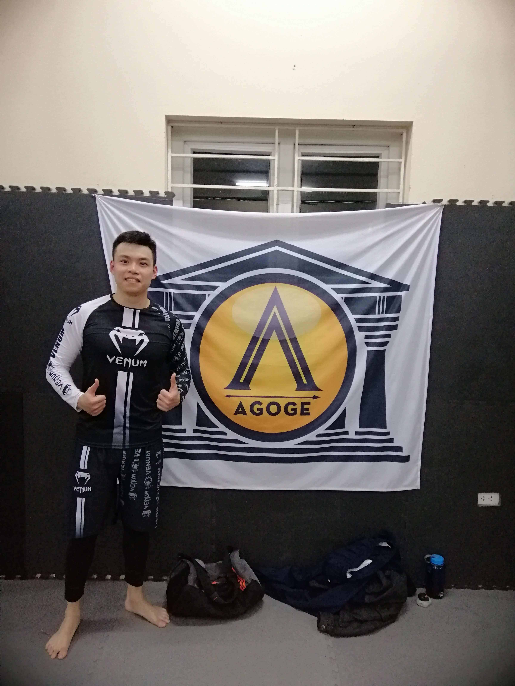

I've heard some wise men said:

> The best mentor is someone who’s 1–2 years in front of you. Someone who has just been through what you’re about to go through. Any longer and the advice gets fuzzy. You want it when it’s fresh.

It can't be truer.

---

I started with BJJ (Brazilian Jiu-Jitsu) about a year ago (Dec 2018) and I have to tell you that it's one of the hardest sports in the world.

This is a picture of myself back at that time

Basically, it went like this:

- First 6 months: You got crushed every time, by any other members who trained longer than you ... no matter what their size is!
- The next 6 months: You started to stay on top of some smaller guys (or girls). It's good, but don't think that it's because your technique is better. You just used your weight! Sometimes, your Americana lock WORKS! And you got your very first "Ah-ha!" moment.
- After one year: You now have some confidence. Other than just staying on top, you can do some triangle, armbar, Kimura armlock movements... Sweeping new guys are much easier than before.
- After that, well ... I don't know. I will tell you when I know in the future.

But, after 1 year in BJJ, I realized one very important thing:

> The person who you learned from the most is someone who is just 6-12 months ahead of you

Why? You might ask...

Why it's not the teacher who trained BJJ professionally for more than 2 years? Or why it's not the brown bell computer geek who trained for 8 years?

> Because they don't remember how it feels like when they started anymore

Yes, only the guy who has just trained for 6 months can remember exactly how difficult it was with a first reverse shrimp.

Time after time, everything gets easier. A 4-years practitioner might laugh when a new guy can't even do a shrimp. He doesn't remember that he was just the same 4 years ago.

So remember, the best mentor you can find is the person who, 1-2 years ago, did exactly what you want to do !
