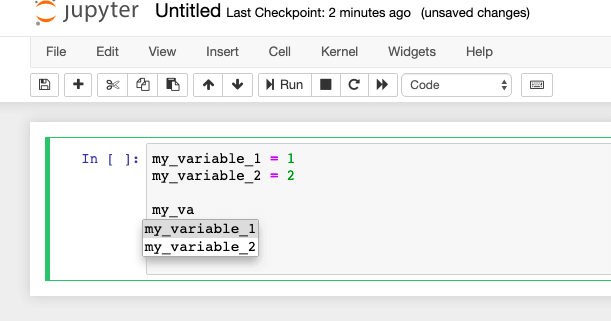
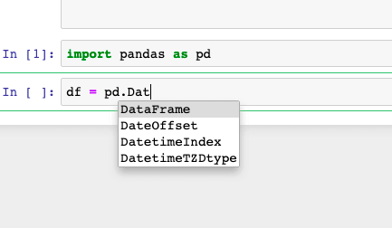
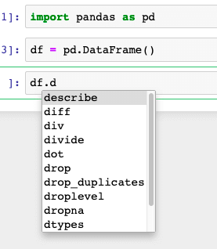

> The best productivity tool for Data Scientist you should be using if you are not doing it yet …

Most of the programmers are fairly familiar with different autocomplete tools. However, I have noticed that many Data Scientists do not use it, at least not early enough in their career or education. If you are one of them the time has come to start using this productivity tool

---

## What is autocomplete?

It is a functionality provided by your programming environment to complete the code you are writing. It has been a blessing for most of the programmers' and it will be for you if you start using it now.

These are only a few advantages of using autocomplete:

- Time saving. You will not have to type this long variable any more!
- Fewer bugs. So how many times your code did not run because you mistyped your variable. And then when you corrected it, you found the same typo just on another line. And it took only 30 mins to discover all small typos while debugging your code. Not anymore, welcome autocomplete.
- A quick lookup of objects methods and attributes. You can use autocomplete to see the methods and attributes of the object without looking at the documentation.

---

## Jupyter notebook autocomplete

How can you use Jupyter notebook autocomplete? The good news is: you do not install anything as it comes with the standard jupyter notebook set up.

### Autocomplete for variables

To start using autocomplete you have to start typing your variable name and hit the tab button on your keyboard. When you do it the box with the completed suggested variable names will appear just like on the screenshot below:

In the example above I have typed ‘my_va’ and hit the tab button.

Autocomplete has suggested that there are two variable names that start with ‘my_va’ and that I could use my_variable_1 and my variable_2.

If there was just one variable available for the prefix that I have typed instead of showing the choice dropdowns, autocomplete would type the whole variable name for me.

### Autocomplete for classes

If you want to create a new object you can use autocomplete as well. The example below shows autocomplete for `pd.Dat`:

### Autocomplete for methods and objects attributes

If you have created an object already and assigned it to some variable you can use autocomplete to access the list of methods and parameters available with the typed prefix. As you can see here the data frame has several methods and params that start with a letter d.

### Autocomplete for modules

Last but not least you can use autocomplete to import the names of your modules.

So you almost remember how this library with many cool algorithms was called but not fully.

You can use autocomplete to help you. Just below there is a list of suggestions for importing modules staring with ‘ma’ prefix.

---

## Conclusion

I have presented several usages of autocomplete in jupyter notebook and I hope I have convinced you to start using it (if you have not been doing that yet). So from now on, there are no excuses and you should introduce autocomplete to your code writing routine.
