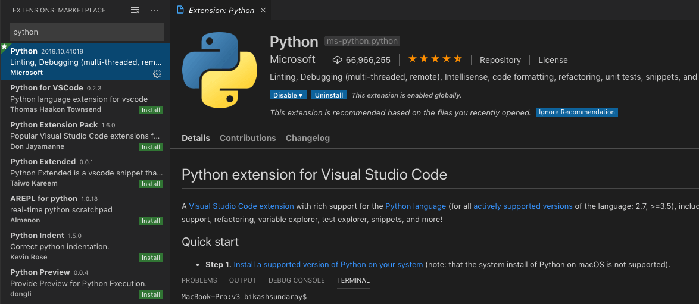
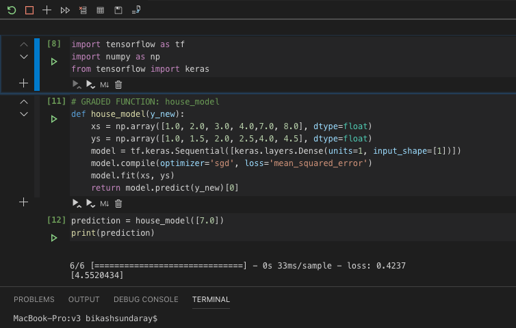
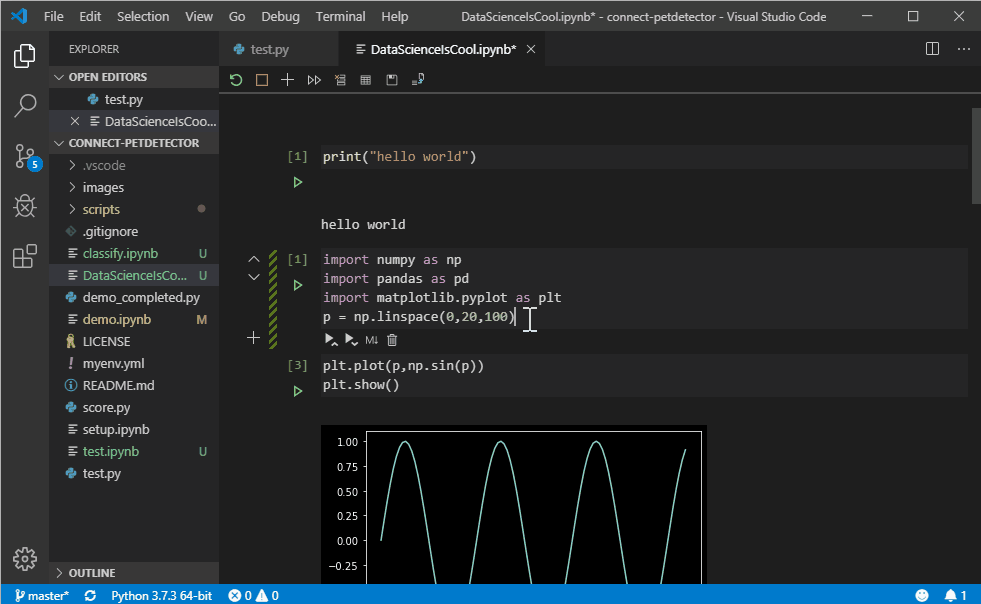

People who work in Python, they love to do their research and experiments in Jupyter Notebook. I am a fan of lightweight code editors like Visual Studio Code (VS Code) and Sublime Text. VS Code is a world class tool to write code in any language. Not just writing code, it supports many DevOps tools like Ansible, Kubernetes, Yaml, Docker and many more.

Most Data Scientists around the globe use Jupyter Notebook as an editor for Machine Learning Development, Research and Experiment. Jupyter Notebook Supports Python, Java, R, Julia, Matlab, Octave, Scheme, Processing, Scala, and many more. It's an editor and to be precise it's a web-based editor designed for python and other Programming Languages. Previously Jupyter notebook was known as iPython. It’s open Source, everyone around the globe uses it.

Microsoft Officially announces native support of Jupyter Notebook in VS Code by installing Official Python Extension.

## How to set up VS Code

Download and install the latest version of VS Code editor [https://code.visualstudio.com/download](https://code.visualstudio.com/download)

Go to **Extensions** section (left side menu) in VS Code and search for 2 extensions: [**Python**](https://marketplace.visualstudio.com/items?itemName=ms-python.python) and [**IntelliCode**](https://marketplace.visualstudio.com/items?itemName=VisualStudioExptTeam.vscodeintellicode) (both officially supported by Microsoft).

Install both extensions and restart.

> Note: In case your Python extension is installed, you can update your old Python Extension by clicking on the Update button.

## How to use Jupyter Notebook in VS Code

**Create New Notebook in VS Code:** shortcut CTRL + SHIFT + P (Windows) or Command + SHIFT + P (macOS), and run the “Python: Create Blank New Jupyter Notebook” command.

**Open existing Notebook in VS Code:** After restarting VS Code IDE, Open Jypyter Notebook file (.ipynb file) from the file menu.

Click on the Play button present in the left side of each cell to execute code present in cell.

When a Jupyter notebook file is created or opened, VS Code automatically creates a Jupyter server for you locally by default.

If you want to use a remote Jupyter server — it’s as simple as using the “Specify Jupyter server URI” command via the VS Code command palette, and entering in the server URI. Shortcut CTRL + SHIFT + P (Windows) or Command + SHIFT + P (macOS).

The way you use Python packages in Jupyter Notebook, you can use all your python packages and you will get in-place results (cell result). For example, I have used matplotlib and getting my graph output in-place the same as Jupyter.

**Debug Jupyter Notebook code in VS Code:** Currently, to debug a Jupyter Notebook you will need to first export it as a Python file. Once exported as a Python file, the VS Code debugger lets you step through your code, set breakpoints, examine state, and analyze problems. Using the debugger is a helpful way to find and correct issues in notebook code.

- For the whole Notebook, open the Command Palette (⇧⌘P) and run the Python: Debug Current File in Python Interactive Window command.

- For an individual cell, use the Debug Cell adornment that appears above the cell. The debugger specifically starts on the code in that cell. By default, Debug Cell just steps into user code. If you want to step into non-user code, you need to uncheck Data Science: Debug Just My Code in the Python extension settings (⌘,).

## The best features in VS Code - beyond Jupyter Notebook

### Intelligent code Autocomplete

As you write code, IntelliSense will give you intelligent code complete suggestions right inside your code cells. You can further supercharge your editor experience by installing our IntelliCode extension to get AI-powered IntelliSense with smarter auto-complete suggestions based on your current code context.

### Variable Explorer

Another benefit of using VS Code is that you can take advantage of the variable explorer and plot viewer by clicking the “Variables” button in the notebook toolbar. The variable explorer will help you keep track of the current state of your notebook variables at a glance, in real-time.

Happy coding!
