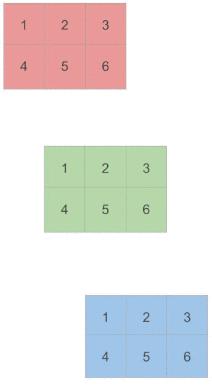

When I started doing some basic operations with PyTorch tensors like summation, it looked easy and pretty straightforward for one-dimensional tensors:

```shell
>> x = torch.tensor([1, 2, 3])
>> torch.sum(x)
tensor(6)
```

However, once I started to play around with 2D and 3D tensors and to sum over rows and columns, I got confused mostly about the second parameter `dim` of `torch.sum`.

Let’s start by what the official documentation says:

> **torch.sum(input, dim, keepdim=False, dtype=None) → Tensor**
>
> _Returns the sum of each row of the input tensor in the given dimension dim._

I don’t quite understand this explication. We can sum up over columns so why do one mention that it just “returns the sum of each row” ? This was my first incomprehension.

However, the more important problem was, as I said, the direction of each dimension. Here’s what I mean. When we describe the shape of a 2D tensor, we say that it contains some **rows** and some **columns**. So for a 2x3 tensor we’ve 2 rows and 3 columns:

```shell
>> x = torch.tensor([
     [1, 2, 3],
     [4, 5, 6]
   ])
>> x.shape
torch.Size([2, 3])
```

We specify at first the rows (2 rows) and then the columns (3 columns), right? That brought me to the conclusion that the first dimension (dim=0) stays for rows and the second one (dim=1) for columns. Following the reasoning that the dimension dim=0 means row-wise, I expected `torch.sum(x, dim=0)` to result in a `1x2` tensor (`1 + 2 + 3` and `4 + 5 + 6` for an outcome of tensor[6, 15]). But it turned out I got something different: a `1x3` tensor.

```shell
>> torch.sum(x, dim=0)
tensor([5, 7, 9])
```

I was surprised to see that the reality was the opposite of what I’ve expected because I finally got the result tensor[6, 15] but when passing the parameter _dim=1_:

```shell
>> torch.sum(x, dim=1)
tensor([6, 15])
```

So why is that? I found out [**an article**](https://medium.com/@aerinykim/numpy-sum-axis-intuition-6eb94926a5d1) of [Aerin Kim](https://medium.com/@aerinykim) 🙏 tackling down the same confusion but for NumPy matrices where we pass a second parameter called axis. NumPy sum is almost identical to what we have in PyTorch except that dim in PyTorch is called axis in NumPy:

> _numpy.sum(a, axis=None, dtype=None, out=None, keepdims=False)_

The key to grasp how _dim_ in PyTorch and _axis_ in NumPy work was this paragraph from Aerin’s article:

> _The way to understand the **“axis”** of numpy sum is that it **collapses** the specified axis. So when it collapses the axis 0 (the row), it becomes just one row (it sums column-wise)._

She explains very well the functioning of the _axis_ parameter on _numpy.sum_. However, it becomes trickier when we introduce a third dimension. When we look at the shape of a 3D tensor we’ll notice that the new dimension gets prepended and takes the first position i.e. the third dimension becomes `dim=0`.

```shell
>> y = torch.tensor([
     [
       [1, 2, 3],
       [4, 5, 6]
     ],
     [
       [1, 2, 3],
       [4, 5, 6]
     ],
     [
       [1, 2, 3],
       [4, 5, 6]
     ]
   ])

>> y.shape
torch.Size([3, 2, 3]) // Notice the first 3
```

Yes, it’s quite confusing. That’s why I think some basic visualizations of the process of summation over different dimensions will greatly contribute to a better understanding.

The first dimension (_dim=0_) of this 3D tensor is the highest one and contains 3 two-dimensional tensors. So in order to sum over it we have to collapse its 3 elements over one another:

```shell
>> torch.sum(y, dim=0)
tensor([[ 3,  6,  9],
        [12, 15, 18]])
```

Here’s how it works:



For the second dimension (_dim=1_) we have to collapse the rows:

```shell
>> torch.sum(y, dim=1)
tensor([[5, 7, 9],
        [5, 7, 9],
        [5, 7, 9]])
```


And finally, the third dimension (_dim=2_) collapses over the columns:

```shell
>> torch.sum(y, dim=2)
tensor([[ 6, 15],
        [ 6, 15],
        [ 6, 15]])
```


If you’re like me, recently started to learn PyTorch or NumPy, I hope these basic animated examples will help you to get a better understanding of how dimensions work, not only for sum but for other methods as well.

Thanks for reading!
