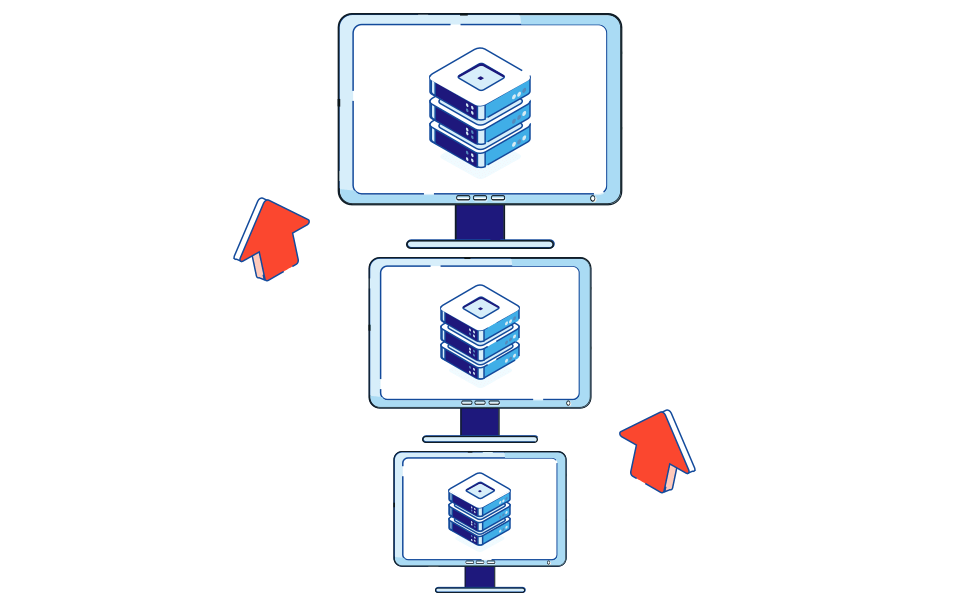
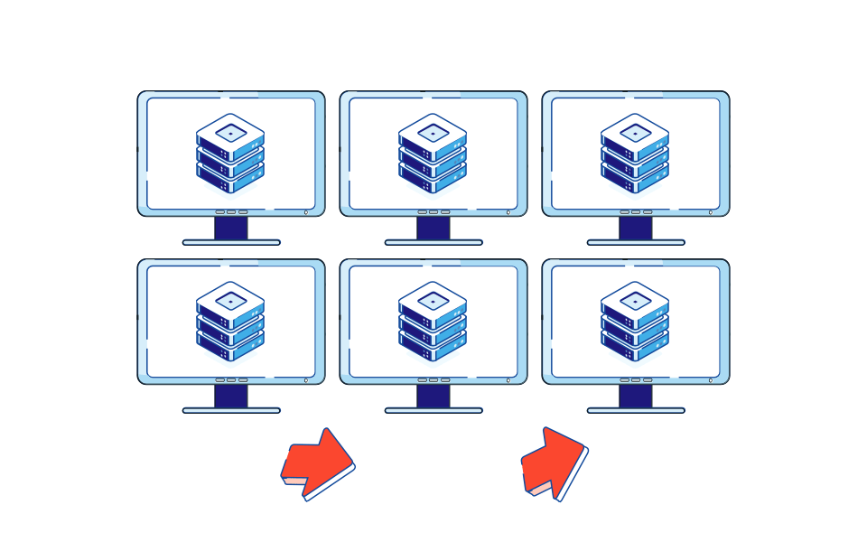
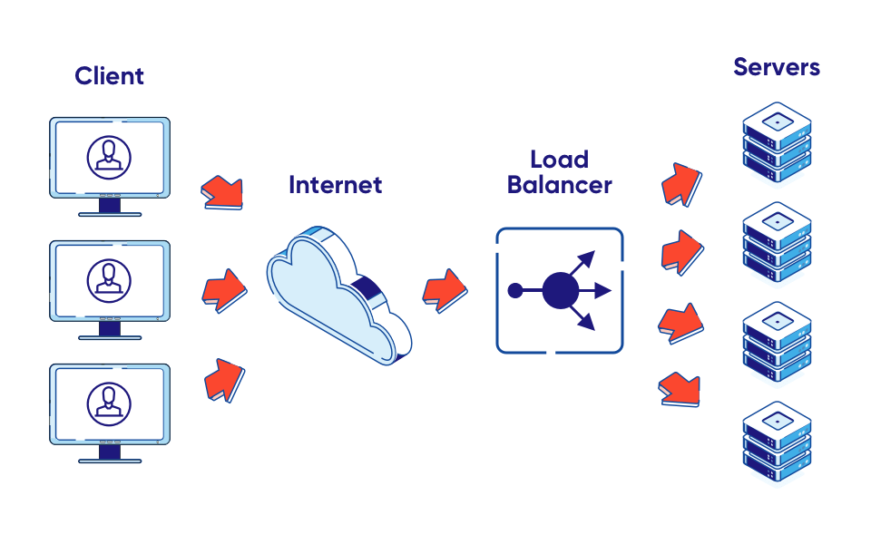
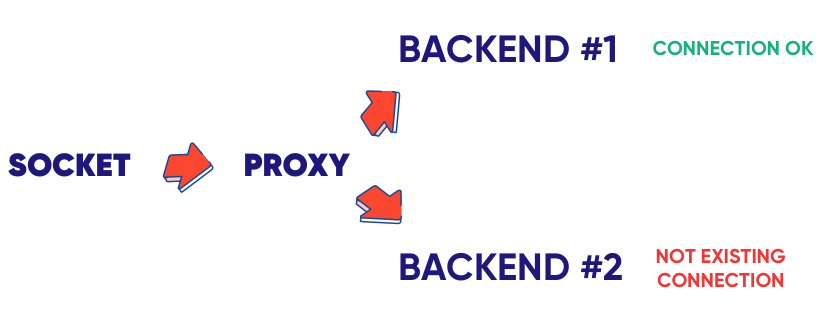

It's very easy to integrate `socket.io` (or similar websocket libraries) into your web application and deploy it on _**one server**_. But when you need to think about horizontal scalability (aka, adding more servers), it is a whole different story.

---

As a developer, you probably know the difference between vertical and horizontal scaling. But if you don’t have much experience with the WebSocket protocol, you might not realize that doing horizontal scaling for it is not nearly as straightforward as with a typical REST API. In this tutorial, we learn how to scale horizontally WebSocket servers on easy practical examples.

When we start thinking about the development of an application, we usually first focus on an MVP and the most crucial features. It’s fine, as long as we are aware that at some point we will need to focus on scalability. For most of the REST APIs, it’s rather easy. However, it’s a whole different story when it comes to WebSockets.

## I. Vertical vs horizontal scaling – what’s the difference

We all know what scaling is, but do we know that there are two types of scaling – horizontal and vertical scaling?

The first one is the vertical scaling. It is by far the easiest way to scale your app, but at the same time, it has its limitations.



Vertical scaling is all about resources, adding more power by adding more machines. We’re going to keep a single instance of our application and just improve hardware – better CPU, more memory, faster IO etc. Vertical scalability doesn’t require any additional work and, at the same time, it isn’t the most effective scaling option.

First of all, our code execution time is not changing linearly with the improved hardware. What’s more, we’re limited by possible hardware improvements – obviously, we cannot improve our CPU speed infinitely.

So, what about an alternative?

Instead of adding more resources to existing instances, we might think about creating additional ones. This is called horizontal scaling.



The horizontal scalability approach allows us to scale almost infinitely. Nowadays it’s even possible to have dynamic scaling – instances are being added and removed depending on a current load. It’s partly thanks to the trend of scaling in cloud computing.

On the other hand, it requires a little bit more configuration, since you need at least one additional piece – load balancer, something responsible for request distribution to a specific instance – and for some systems we need to introduce additional services, for example messaging.

---

## II. Problems of horizontal scaling with WebSocket & Solutions

### 1. Problem #1: State

OK, let’s say we have two simple apps.

One is a simple REST API:

```javascript
const express = require("express");

const app = express();

const mockedUsers = [
  {
    id: 1,
    firstname: "John",
    lastname: "Doe"
  }
];

app.get("/users", (req, res) => {
  res.json(mockedUsers);
});

app.listen(3000);
```

The other one is a simple WebSocket API:

```javascript
const WebSocket = require("ws");

const wss = new WebSocket.Server({ port: 8080 });

const mockedUsers = [
  {
    id: 1,
    firstname: "John",
    lastname: "Doe"
  }
];

wss.on("connection", ws => {
  ws.on("message", data => {
    const message = JSON.parse(data);

    if (message.type === "get-users") {
      ws.send(JSON.stringify(mockedUsers));
    }
  });
});
```

Even though both APIs use a different way to communicate, the code base is fairly similar. What’s more, there will be no difference between those two when it comes to vertical scaling.

The problem arises with horizontal scaling.

In order to be able to handle multiple instances, we need to introduce a load balancer. It is a special service responsible for even (using selected strategy) distribution of traffic between instances.



HAProxy is an example of a load balancer. All we need is to provide a simple configuration.

```shell
defaults
  mode http
  option http-server-close
  timeout connect     5s
  timeout client      30s
  timeout client-fin  30s
  timeout server      30s
  timeout tunnel      1h
  default-server inter 1s rise 2 fall 1 on-marked-down shutdown-sessions
  option forwardfor

frontend all
  bind 127.0.0.1:8080
  default_backend backends

backend backends
  server srv1 127.0.0.1:8081 check
  server srv2 127.0.0.1:8082 check
```

As you can see, we’re defining frontend and backends.

The frontend will be public (this is the address used for communication with our backends).

We need to specify an address for it and also the name of the backend that will be used for it.

After that, we need to define our backends. In our case, we have two of them, both using the same IP, but different ports.

By default, HAProxy is using a `round-robin strategy` – each request is forwarded to the next backend on the list and then we iterate from the start.

We also configure so-called health checks, so we make sure that the requests won’t be forwarded to an inactive backend.

So where is the problem?

Most REST APIs are stateless. It means that nothing related to a single user making a request is saved on an instance itself. The thing is, it is not the same case with WebSockets.



Each socket connection is bound to a specific instance, so we need to make sure that all the requests from specific users are forwarded to a particular backend.

How to fix it?

### Solution #1: Sticky session

What we are looking for is a sticky session. Thankfully, we are using HAProxy, so the only thing that needs to be done is some configuration tweaks.

```shell
backend backends
  balance leastconn
  cookie serverid insert
  server srv1 127.0.0.1:8081 check cookie srv1
  server srv2 127.0.0.1:8082 check cookie srv2
```

First of all, we’ve changed the balancing strategy. Instead of using round-robin, we decided to go with `leastconn`. This will make sure that a new user is connected to the instance with the lowest overall number of connections.

The second change is to sign every request from a single user with a cookie. It will contain the name of the backend to be used.

After that, the only thing that is left is to tell which backend should be used for a given cookie value.

At this point we should be fine with handling the single user’s messages. But what about broadcasting?

### 2. Problem #2: Broadcasting

Let’s start with adding a new function to our WebSocket server, so we can send a message to all connected clients at once.

```javascript
const WebSocket = require("ws");

const wss = new WebSocket.Server({ port: 8080 });

const mockedUsers = [
  {
    id: 1,
    firstname: "John",
    lastname: "Doe"
  }
];

wss.on("connection", ws => {
  ws.on("message", data => {
    const message = JSON.parse(data);

    if (message.type === "get-users") {
      ws.send(JSON.stringify(mockedUsers));
    }

    if (message.type === "broadcast") {
      wss.clients.forEach(client => {
        if (client !== ws && client.readyState === WebSocket.OPEN) {
          client.send(JSON.stringify(mockedUsers));
        }
      });
    }
  });
});
```

It looks fine. So where is the catch?

The WebSocket Server knows only about clients connected to this specific instance. This means we’re sending a message only to a set of clients, not all of them.

### Solution #2: Pub/Sub

The easiest option is to introduce communication between different instances. For example, all of them could be subscribed to a specific channel and handle upcoming messages.

This is what we call publish-subscriber or pub/sub. There are many ready-to-go solutions, like Redis, Kafka, or Nats.

Let’s start with the channel subscription method.

```javascript
const redis = require("redis");
const subscriber = redis.createClient({
  url: "redis://localhost:6379"
});

const publisher = subscriber.duplicate();
const WS_CHANNEL = "ws:messages";

subscriber.on("message", (channel, message) => {
  console.log(`Message from: ${channel}, ${message}`);
});

subscriber.subscribe(WS_CHANNEL);

publisher.publish(WS_CHANNEL, "my message");
```

First of all, we need to separate clients for the subscriber and the publisher. That’s because the client in the subscriber mode is allowed to perform only commands related to the subscription, so we cannot use the publish command on that client.

However, we can use a duplicate method to create a copy of a specific Redis client.

After that, we subscribe to a message event. By doing this, we will get any message published on Redis. Of course, we’re also getting information about the channel it was published on.

The last step is to run a publish method to send a message to a specific channel.

And now, onto the last part. Let’s connect it with our WebSocket code.

```javascript
const WebSocket = require("ws");
const redis = require("redis");

const subscriber = redis.createClient({
  url: "redis://localhost:6379"
});
const publisher = subscriber.duplicate();

const WS_CHANNEL = "ws:messages";
const mockedUsers = [
  {
    id: 1,
    firstname: "John",
    lastname: "Doe"
  }
];

const wss = new WebSocket.Server({ port: +process.argv[4] || 8080 });

subscriber.on("message", (channel, message) => {
  if (channel === WS_CHANNEL) {
    wss.clients.forEach(client => {
      if (client.readyState === WebSocket.OPEN) {
        client.send(message);
      }
    });
  }
});

wss.on("connection", ws => {
  console.log("new connection");
  ws.on("message", data => {
    const message = JSON.parse(data);

    if (message.type === "get-users") {
      ws.send(JSON.stringify(mockedUsers));
    }

    if (message.type === "broadcast") {
      publisher.publish(WS_CHANNEL, JSON.stringify(mockedUsers));
    }
  });
});

subscriber.subscribe(WS_CHANNEL);
```

As you can see, instead of sending messages to the WebSocket client right now, we’re publishing them on a channel and then handle them separately. By doing this, we’re sure that the message is published to every instance and then sent to users.

---

## III. Best practices

### Handling failover

Another benefit of using a pub/sub broker to coordinate your WebSockets is that now it’s possible to easily handle failover.

When a client is connected to a WebSocket server, and that server falls over, the client can open a connection through the load balancer to another WebSocket server. The new WebSocket server will just ensure that there is a subscription to the pub/sub broker for the data that the WebSocket client is interested in and start piping through changes on the WebSocket when they occur.

### Avoid Data Duplication

One thing to take into consideration when a client reconnects is making the client intelligent enough that it sends through some sort of data synchronization offset, probably in the form of a timestamp, so that the server doesn’t send it all the data again.

If every update is time stamped, the clients can easily store the latest timestamp that they received. When the client loses the connection to a particular server, it can just reconnect to your websocket cluster (through your load balancer) by passing in the last timestamp that it received and that way the query to the DB can be built up so that it’ll only return updates that occur after the client last successfully received updates.

In lots of applications, it might not be that important to worry about duplicates going down to the client. But even then, it might be a good idea to use a timestamp approach to save both your resources and the bandwidth of your users.

---

## Conclusion

Building a websocket service running on one server is relatively easy. The challenge is to build a service that can be scaled horizontally for load sharing and fault tolerance.

WebSocket horizontal scaling is not a trivial task. You cannot just increase the number of instances, because it won’t work right away. However, with the help of a few tools, we are able to build a fully scalable architecture. All we need is a load balancer (such as HAProxy, Traefik or even Nginx) configured with a sticky-session and messaging system (Kafka, Nats, Redis, ...).

See you in future posts!
