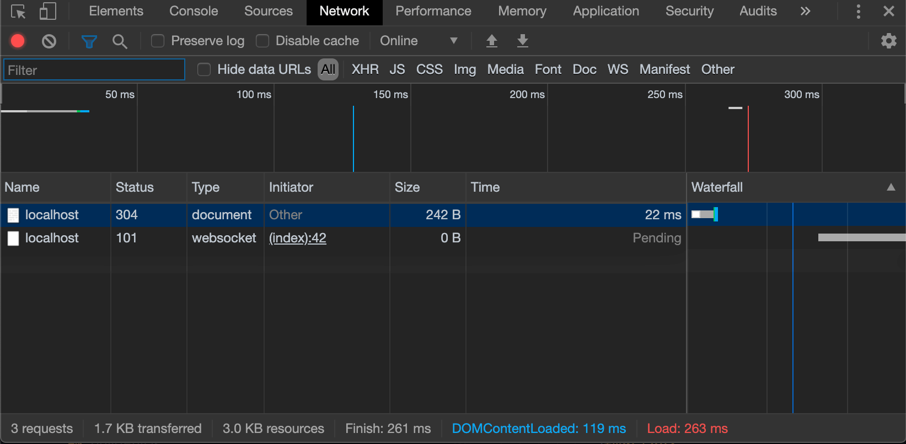
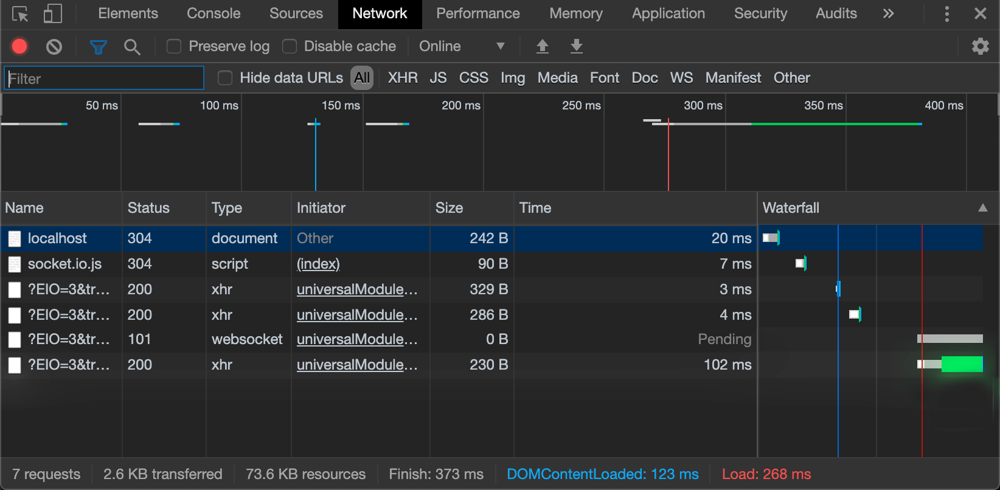

WebSocket and Socket.IO are probably two of the most popular solutions for implementing real-time communications in the modern web. But how do they differ?

When building a real-time application, there's a moment where you have to choose how to implement the realtime data exchange between client and server.
WebSocket and Socket.IO are probably two of the most popular solutions for implementing real-time communications in the modern web.
But which one should we choose? What are the differences between these two technologies?
Let's find out!

---

## WebSocket

When talking about [WebSocket](https://developer.mozilla.org/en-US/docs/Web/API/WebSocket), we're referring to a web communication protocol that provides a full-duplex communication channel over a single TCP connection.
In few words, it allows interactions between client and server with a minimum overhead, allowing us to build applications that uses the advantages of real-time communications.

For instance, imagine if you're building a chat app: you need to receive and send data as soon as possible, right?
Well, that's the right job for WebSocket! You can just open one TCP connection and share data leaving it open as long as you need it.

WebSocket first appeared in 2010 in Google Chrome 4, and the first RFC ([RFC 6455](https://tools.ietf.org/html/rfc6455)) has been published one year later, in 2011.

Great use cases for WebSocket includes:

- Chat Applications
- Live streaming
- Multiplayer Games
- Collaborative Editing
- Social Feeds
- Location-based Applications

and many more...

## Socket.IO

[Socket.IO](https://socket.io/) is a JavaScript library built on top of WebSocket… and other technologies.
In fact, it uses WebSocket when available, but it's ready to fallback to other technologies such as Flash Socket, AJAX Long Polling, AJAX Multipart Stream and many more; that allows Socket.IO to be used in contexts where WebSocket is not supported.
There's an amazing article in the Ably blog which describes its features in depths.

---

## Differences between WebSocket and Socket.IO

The main advantages of Socket.IO over WebSocket are:

- Unlike WebSocket, Socket.IO allows you to broadcast a message to all the connected clients. For instance, if you're writing a chat application and you want to notify all the connected clients that a new user has joined the chat, you can easily broadcast that message in one shot to everyone.
- Using plain WebSocket, you'll need a list of all the connected clients and then send the message directly one by one.
- Proxies and load balancers makes WebSocket hard to implement and scale. Socket.IO supports these technologies out of the box.
- As said before, Socket.IO is able to fallback to technologies other than WebSocket when the client doesn't support it.
- If (for some reason) a WebSocket connection drops, it will not automatically reconnect… but guess what? Socket.IO handles that for you!
- Socket.IO APIs are built to be easier to work with.

> So, it seems that Socket.IO is something like "the heaven of real-time communications", right?

Well, there are actually some good reasons for using vanilla WebSocket.

First of all, every modern browser supports WebSocket these days.

Socket.IO uses much more boilerplate code and resources in order to make it fallback to other technologies. Most of the time, you don't need this level of support.

Even in terms of network traffic, Socket.IO is way more expensive.

In fact, with plain WebSocket the browser may need to run just two requests:

- The `GET` request for the HTML page
- The `UPGRADE` connection to WebSocket

And that's it. You're ready to start a realtime communication with your server!

But what about Socket.IO?

- The `GET` request of the HTML page
- Socket.IO client library (207kb)
- Three long polling Ajax request
- The `UPGRADE` connection to WebSocket

In a world where we're using a lot of JavaScript code and libraries are drastically reducing their weight… 207kb are a lot! And what about all these requests? What a waste of network traffic!

There's even an `npm` package called [websocket-vs-socket.io](https://www.npmjs.com/package/websocket-vs-socket.io) that has been built for comparing the network traffic of those two technologies:

WebSocket network traffic:



Socket.IO network traffic:



what a huge difference!

---

## Writing realtime application

So far we have just seen some differences on paper, but how do they differ when writing a realtime application?

### Simple WebSocket server

In the following Node.js program, we're creating a WebSocket server exposed on port 3001. Everytime that a client connects, we'll assign a unique ID to its session.
When the client sends a message, we'll just reply with the following format: `[<client-id>]: <message>`, so he'll know that the message has been successfully sent.

```javascript
const WebSocket = require("ws");
const UUID      = require("uuid");
const wss       = new WebSocket.Server({ port: 3000 });

wss.on("connection", ws => {
  ws.id = UUID();

  ws.on("message", message => {
    ws.send(`[${ws.id}]: ${message}`);
  });

});
```

Great! But what if I want to broadcast that message to every connected client? WebSocket doesn't support message broadcasting by default!
That's right, but message broadcasting is still easy to implement with vanilla WebSocket:

```javascript
const WebSocket = require("ws");
const UUID      = require("uuid");
const wss       = new WebSocket.Server({ port: 3000 });

function broadcast(clientId, message) {
  wss.clients.forEach(client => {
    if (client.readyState === WebSocket.OPEN) {
      client.send(`[${clientId}]: ${message}`);
    }
  });
}

wss.on("connection", ws => {
  ws.id = UUID();
  ws.on("message", message => broadcast(ws.id, message));
});
```

So easy! As you can see, the `WebSocket.Server` keeps track of every connected client, so we can just loop over them and send the desired message to everyone!
We've just implemented the easiest chat server ever!
You can test the code above with any WebSocket client, both on desktop, or via Chrome Extension.

### Simple Socket.IO server

Ok, that has been incredibly easy! But Socket.IO promises to make it even easier! How should we implement the exact same server with that library?

```javascript
const io     = require("socket.io");
const server = io.listen(3002);

server.on("connection", socket => {

  socket.on("message", message => {
    socket.emit(`[${socket.id}]: ${message}`);
    socket.broadcast.emit(`[${socket.id}]: ${message}`);
  });

});
```

Wow! Nearly half of the WebSocket server code!
As you can see, with the Socket.IO native `broadcast` method we're not sending the message back to the sender; for that reason, we'll need to manually emit that message to the client.

But there's a problem: you can't test it on a standard WebSocket client (as we've seen in the previous example). That's because (as said before), Socket.IO doesn't use plain WebSocket, but mixes multiple technologies in order to support as many clients as possible (and to avoid certain problems, as described above).
So how do can you test it?

```html
<html>
  <head>
    <script src="https://cdn.jsdelivr.net/npm/socket.io-client@2.3.0/dist/socket.io.slim.js"></script>
  </head>
  <body>
    <script type="text/javascript">
      ioClient = io.connect("http://localhost:3000");
      ioClient.on("connect", socket => {
        ioClient.send("Hello everybody!");
        ioClient.on("message", msg => console.log(msg));
      });
    </script>
  </body>
</html>
```

You'll need to use the Socket.IO client. In the above example, we're using a CDN-delivered client that will allow us to make some quick and dirty tests on a web browser.

As you can see, these two example may not seem so different… but when it comes to compatibility, you have to keep in mind that Socket.IO will always work with its own client library, so you won't be able to use it for purposes other than web development.
That is not true for WebSocket, that might be used to solve a large set of problem, such as p2p communications, realtime server-to-server data transfer and so on.

---

## Things to keep in mind

As we've seen at the beginning, there are many problems that Socket.IO tries to solve.

- Horizontal scaling. Let's say that your chat app is having lot of success and you need to add another server and a load balancer in order to handle all the requests. Well, if you're opening a connection on the “server 1", but then the load balancer switches you to the “server 2", you'll get the following error: "Error during WebSocket handshake: Unexpected response code: 400". Socket.IO solves that problem using a cookie (or routing the connection based on their originating address), but WebSocket doesn't provide an alternative mechanism out of the box. To do it the right way, check [this article](/websocket-horizontal-scaling)
- Performances. As we've said before, Socket.IO provides multiple layers of abstraction over vanilla WebSocket transport layer. It will also enforce JSON packaging, so you won't be able to send real binary data from client to server (and vice versa). If you'll ever need to achieve that level of performance, you'll need to customize the library in order to avoid that specific behavior. With vanilla WebSocket you won't never have this problem.

---

## Conclusion

So, what should I choose?

Well, there's not a simple answer to this question.

Socket.IO may make things a bit easier for sure; you don't have to worry about load balancer related issues, connection failures and message broadcasting,… but are you sure you really need these features? Just the Socket.IO client library alone is heavier than React, Redux and React-Redux packaged together. Are you sure that you can't use the browser native WebSocket API?

Another thing to keep in mind is that Socket.IO, implemented server-side, is a custom library/framework where most of the time you're not following the vanilla WebSocket logic, because of the abstractions applied by Socket.IO itself.

If you're refactoring your Node.js microservices (let's say) to Go, Java, PHP or any other language, you'll have to rewrite most of the logic behind the Socket.IO behavior in order to achieve the same results with vanilla WebSocket. For instance, think about broadcasting a message to every connected client: with Socket.IO is just one method (`.broadcast`), but in vanilla WebSocket you'll have to implement it on your own, so you'll have to rethink about the way it works.

So in my opinion, it is worth it to start working with vanilla WebSocket from the beginning, so it will be easier to refactor, extend or implement new features in other languages (if you're writing microservices/lambdas etc).
