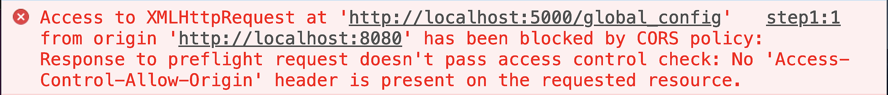
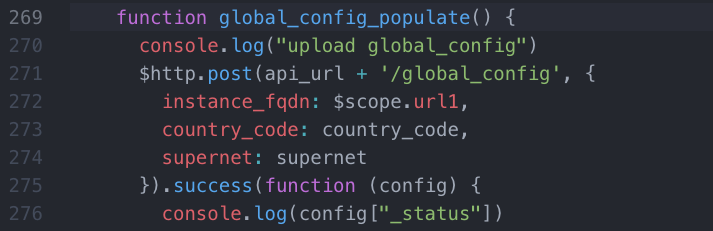
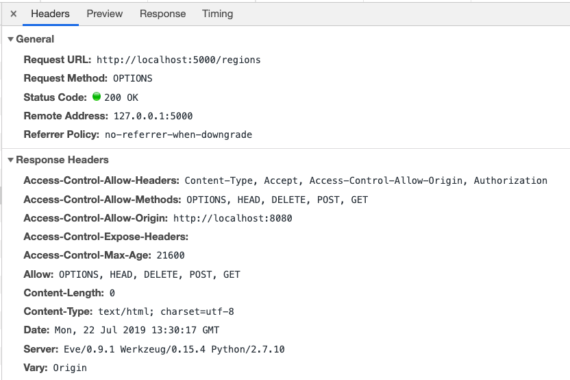

Imagine you're building the UI. You need to connect to remote API to get or send some data. Everything works fine when you test your `REST` calls with `curl`, but when you implement them in the UI, it does not.

First, you check the code, looking for some typos or other mistakes - but everything seems to be fine. You change the URL to Google.com or something, and find out that the http call is working. The issue appears only when calling that specific API. But it works perfectly fine via command line or Postman. What's going on then?

Well, it's probably the mysterious `CORS` mechanism blocking you. Rather than making an assumption, though, let's just check the developer console in the browser.

So if you hit right click, select `Inspect`, and go to `Console` tab, and then see an error like this one ...

… then indeed, it's `CORS`.

But before you jump to Stack Overflow asking `How to fix CORS in React/Vue/whatever?` let's find out what `CORS` really is, and why you can't fix it in the UI.

---

## What is CORS?

`CORS` stands for `Cross-Origin Resource Sharing`. Doesn't explain much, huh?

Well, it's really simple to understand, but there are a lot of misconceptions about `CORS` and plenty of available "solutions" that don't work.

When they're blocked by `CORS`, many people google a `solution for CORS`, copy-and-paste a few lines of code that addresses something about the headers, and move forward. While this may sometimes fix your problem momentarily, it may also create a huge security risk.

But we'll talk about that later. First things first: What is `CORS`?

`CORS` is a security mechanism built into (all) modern web-browsers (yes! into your web browser! That's why your `curl` calls works fine). It basically blocks all the http requests from your front end to any API that is not in the same `"Origin"` (domain, protocol, and port—which is the case most of the time).

Now, how does this mechanism work? Let's say you have an "upload" button in the UI that suppose to upload some form of data to the API. So, in HTML code, you bind that button to some JavaScript function, which does a `HTTP POST` call:

So when you click that button, you would expect the `HTTP POST` being sent to the API. But instead, your browser, seemingly 'hidden' from you, will send a `HTTP OPTIONS` request (but not always! Will get to it in a second) to the API. The API will typically reply with a bunch of data that says what browser is allowed to do.

Now, one thing to mention here: `HTTP OPTIONS` is sent before your actual request, if that request is considered a "non-simple" request. A "non-simple" request is one that has `Content-type` other than `application/x-www-form-urlencoded`, `multipart/form-data`, or `text-plain` (for example, JSON) or when requests include cookies. (So, pretty much, most of the time.)

And now, we're talking `CORS`. Below, you'll see an example of the headers sent back by the server (yes, by server - therefore CORS is not something you can fix in the UI code) with a reply to `OPTIONS`. Look at those `Access-Control-*` headers and focus on `Access-Control-Allow-Origin`:

Here's what's happening: before sending your requested API call, your browser does a 'security check' by asking the API, (via an `OPTIONS` call, who is allowed to do what. Simple as that.

An "issue with CORS" occurs when the API does not reply to such request with, "Yes, dear browser, you are allowed to do that call".

So, as you can see on the screenshot above, my API responded that my UI, localhost, is allowed to handle `OPTIONS`, `HEAD`, `DELETE`, `POST` and `GET` calls.

Now that's the core of all the "problems" with `CORS`. In order to fix `CORS`, you need to make sure that the API is sending proper headers (`Access-Control-Allow-*`). That's why it's not something you can fix in the UI, and that's why it only causes an issue in the browser and not via curl: because it's the browser that checks and eventually blocks the calls.

---

## Solutions and Security

So, how to fix it properly without creating a security hole? As I mentioned earlier, people who encounter these errors often just google for a solution and copy-and-paste a few lines of code, which adds proper headers. The problem with that is that, in most cases, those "solutions" tell You to use `Access-Control-Allow-Origin: *` - in other words, basically allow anyone to access Your API.

You might ask, What's the problem with that? I have authentication on my API anyway. (Which should always be the case, right?)

Well, if you do, then this solution won't work for you. Because if your call from the browser contains an Authorization header, then the value of `Access-Control-Allow-Origin` can't be `'*'`.

So the key points to know by now:

- `CORS` is a mechanism built into web browser. It's not a UI code issue.
- To fix `CORS` problems, you need to make changes on the API side.

> _But… but…_, you protest, _I don't have access to that API!_

Well, in that case, you have two options:

- Ask whoever manages API to fix/add CORS support
- Create middleware

**Option 1** is clear, right? If the API you are trying to access is your company API, then just go to your backend colleagues and ask them to add CORS support. How they do that will depend on the framework they use. Sometimes it's as easy as installing some package, sometimes they have to add those headers manually to the API code, but nevertheless - they should know.

If the API is from some third party, then either you can contact them via their support line, or Github, or some other way. Or, you can use Option 2.

**Option 2**: build a middleware. Since `CORS` is as simple as adding some `HTTP` headers, and it's the only browser blocked, then you can build some proxy-like component that will basically make a call for you, get the response from the desired API, add those headers on top, and then send it back to Your UI. Thus, you will no longer connect directly to that API, but to your middleware. It's not the best solution, but if really necessary, it will solve the issue.

There is also another use case, You have some tool installed on one of the servers you manage. You can't directly change the code of that tool, but you still need to add `CORS` support to it. In such a case, something you can do is install, for example, Nginx — add headers in Nginx config, and put that tool as a backend.

That's it. I hope you not only got a solution to issues with CORS but, most importantly, you learned how it works. And now you have some ideas for how to fix things when you get those once-mystifying `CORS` messages.

Happy coding!
