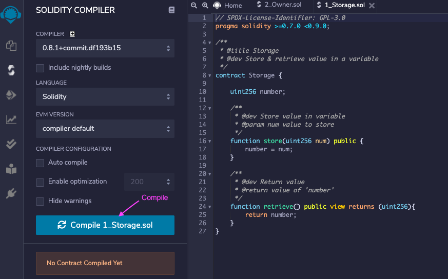
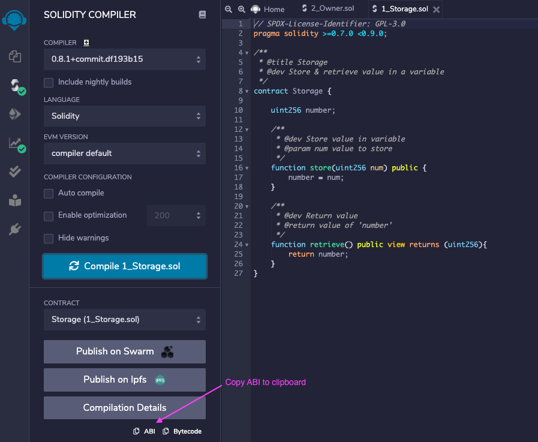
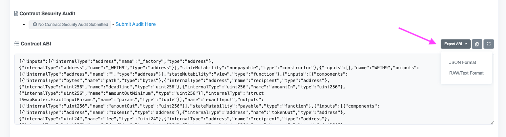

To interact with Ethereum smart contracts in Go programs, you need bindings for the specific type of contract. This post is a quick guide for generating these bindings from various sources:

1. Manually compiled Solidity contract
2. Smart contracts with Truffle (eg. [OpenZeppelin contracts](https://openzeppelin.com/contracts/))
3. Compiling a contract on [remix.ethereum.org](https://remix.ethereum.org/)
4. Using the Etherscan ABI API
5. Prebuilt Go bindings

## Table of contents

- [Table of contents](#table-of-contents)
- [Application Binary Interface (ABI)](#application-binary-interface-abi)
- [The abigen tool](#the-abigen-tool)
- [Manually compiled Solidity contract](#manually-compiled-solidity-contract)
- [Smart contracts with Truffle](#smart-contracts-with-truffle)
- [Compiling a contract on remix.ethereum.org](#compiling-a-contract-on-remixethereumorg)
- [Getting the ABI from Etherscan](#getting-the-abi-from-etherscan)
- [Prebuilt Go bindings](#prebuilt-go-bindings)
- [Using the Go bindings](#using-the-go-bindings)
- [References](#references)

## Application Binary Interface (ABI)

The [Application Binary Interface (ABI)](https://docs.soliditylang.org/en/develop/abi-spec.html) of a smart contract describes how you call its functions and what kind of data you get back. The Go bindings are generated from such an ABI.

The Contract Application Binary Interface (ABI) is the standard way to interact with contracts in the Ethereum ecosystem, both from outside the blockchain and for contract-to-contract interaction. Data is encoded according to its type, as described in this specification. The encoding is not self describing and thus requires a schema in order to decode.

The ABI usually has the form of a JSON file which can be generated from the smart contract source code. Take a look at [this example ABI JSON](https://gist.github.com/metachris/ebff1e3d04c6874c5631c14badcb6ded#file-store-abi). The following sections explain how to create (or get) the ABI from various forms of smart contracts, and to generate Go bindings from it.

## The abigen tool

[abigen](https://geth.ethereum.org/docs/dapp/native-bindings) is used to generate the Go bindings from an ABI JSON file, and is part of [go-ethereum](https://github.com/ethereum/go-ethereum). Make sure you have the latest version of it!

You can build, install and run `abigen` like this:

```bash
# Download go-ethereum, build and install the devtools (which includes abigen)

git clone <https://github.com/ethereum/go-ethereum.git>
cd go-ethereum
make devtools

# Run abigen and print the version

abigen -version
abigen -help
```

Examples for how to generate Go bindings with `abigen`:

```bash
# Create Go bindings from an ABI file (without bytecode)

abigen --abi <input-file.abi> --pkg <go-package-name> --out <output-file.go>

# Create Go bindings from an ABI + BIN file (with bytecode)

abigen --abi <input-file.abi> --bin <input-file.bin> --pkg <go-package-name> --out <output-file.go>

# Create Go bindings from a Solidity source file (with bytecode)

abigen --sol <input-file.sol> --pkg <go-package-name> --out <output-file.go>
```

See also:

- <https://geth.ethereum.org/docs/dapp/native-bindings>
- <https://github.com/ethereum/go-ethereum>

## Manually compiled Solidity contract

If you have a smart contract with full Solidity source code (eg. `Store.sol`):

```solidity
/ SPDX-License-Identifier: GPL-3.0
pragma solidity >=0.7.0 <0.9.0;

/**
 * @title Storage
 * @dev Store & retrieve value in a variable
 */
contract Storage {
    uint256 number;

    /**
     * @dev Store value in variable
     * @param num value to store
     */
    function store(uint256 num) public {
        number = num;
    }

    /**
     * @dev Return value 
     * @return value of 'number'
     */
    function retrieve() public view returns (uint256){
        return number;
    }
}
```

you can compile it with `solc` and generate the bindings like this:

```bash
# Create the ABI (writes a file called build/Store.abi)

solc --abi Store.sol -o build

# Generate the Go bindings (without bytecode)

abigen --abi build/Store.abi --pkg store --out store.go
```

If you want to include the contract bytecode (needed to deploy the contract):

```bash
# Create ABI and bytecode

solc --abi Store.sol -o build
solc --bin Store.sol -o build

# Generate the Go bindings (with bytecode)

abigen --abi build/Store.abi --bin build/Store.bin --pkg store --out store.go
```

`abigen` can also generate the bindings with bytecode automatically in one command:

```bash
abigen --sol Store.sol --pkg store --out store.go
```

## Smart contracts with Truffle

[Truffle](https://www.trufflesuite.com/docs/truffle/overview) is a popular Ethereum smart contract development toolkit. It is often paired with [Ganache](https://www.trufflesuite.com/ganache) - a tool to run local Ethereum blockchains for development. [Truffle quickstart docs](https://www.trufflesuite.com/docs/truffle/quickstart) offer a brief introduction into the whole workflow.

Let’s create a minimal [ERC721 (NFT) smart contract](https://eips.ethereum.org/EIPS/eip-721) based on the [OpenZeppelin ERC721 contract](https://docs.openzeppelin.com/contracts/4.x/erc721).

**Step 1**: Setup the project and install dependencies (Truffle, [OpenZeppelin contracts](https://github.com/OpenZeppelin/openzeppelin-contracts) and [@chainsafe/truffle-plugin-abigen](https://www.npmjs.com/package/@chainsafe/truffle-plugin-abigen)):

```bash
# Create the project directory

mkdir mynft && cd mynft

# Install dependencies

yarn init -y
yarn add truffle @openzeppelin/contracts @chainsafe/truffle-plugin-abigen

# Run the Truffle project setup (creates the folder structure)

yarn truffle init
```

**Step 2**: Create the NFT721 smart contract (`contracts/MyNFT.sol`):

```solidity
pragma solidity ^0.8.0;

import "@openzeppelin/contracts/token/ERC721/ERC721.sol";

contract MyNFT is ERC721 {
    constructor() ERC721("MyNFT", "MNFT") {}
}
```

**Step 3**: Edit `truffle-config.json` to set the Solidity compiler version and adding the `abigen` plugin:

```js
module.exports = {
    plugins: [
        "@chainsafe/truffle-plugin-abigen"
    ],
    compilers: {
        solc: {
            version: "0.8.4",    // Fetch exact version from solc-bin (default: truffle's version)
        }
    }
}
```

**Step 4**: Compile the contract and ABI and build the Go interface

```bash
# Compile the contract

$ yarn truffle compile

Compiling your contracts
===========================

> Compiling ./contracts/Migrations.sol
> Compiling ./contracts/MyNFT.sol
> Compiling @openzeppelin/contracts/token/ERC721/ERC721.sol
> Compiling @openzeppelin/contracts/token/ERC721/IERC721.sol
> Compiling @openzeppelin/contracts/token/ERC721/IERC721Receiver.sol
> Compiling @openzeppelin/contracts/token/ERC721/extensions/IERC721Metadata.sol
> Compiling @openzeppelin/contracts/utils/Address.sol
> Compiling @openzeppelin/contracts/utils/Context.sol
> Compiling @openzeppelin/contracts/utils/Strings.sol
> Compiling @openzeppelin/contracts/utils/introspection/ERC165.sol
> Compiling @openzeppelin/contracts/utils/introspection/IERC165.sol

> Artifacts written to build/contracts
> Compiled successfully using:

- solc: 0.8.4+commit.c7e474f2.Emscripten.clang

# Generate the ABI and BIN files (stored in abigenBindings/)

$ yarn truffle run abigen MyNFT

# Create the Go binding with bytecode (~61K)

$ abigen --bin=abigenBindings/bin/MyNFT.bin --abi=abigenBindings/abi/MyNFT.abi --pkg=mynft --out=mynft.go

# Alternatively, create the Go binding without the bytecode (~42K)

$ abigen --abi=abigenBindings/abi/MyNFT.abi --pkg=mynft --out=mynft.go
```

## Compiling a contract on remix.ethereum.org

You can use remix.ethereum.org to compile smart contracts and download the ABI file like this:





Save the copied ABI into a file called `store.abi` and create the Go bindings with `abigen`:

```bash
abigen --abi store.abi --pkg store --out store.go
```

Example code, ABI and Go bindings:

- [Source code](https://gist.github.com/metachris/ebff1e3d04c6874c5631c14badcb6ded#file-store-sol)
- [ABI JSON](https://gist.github.com/metachris/ebff1e3d04c6874c5631c14badcb6ded#file-store-abi)
- [Generated Go bindings](https://gist.github.com/metachris/ebff1e3d04c6874c5631c14badcb6ded#file-store-go)

## Getting the ABI from Etherscan

[Etherscan](https://etherscan.io/) provides ABI downloads for verified smart contracts through the [API](https://etherscan.io/apis#contracts) and website.

Example API call to get the [Uniswap V3 Router contract](https://etherscan.io/address/0xE592427A0AEce92De3Edee1F18E0157C05861564) ABI:

```bash
<https://api.etherscan.io/api?module=contract&action=getabi&address=0xE592427A0AEce92De3Edee1F18E0157C05861564>
```

Response:

```json
{
"status": "1",
"message": "OK-Missing/Invalid API Key, rate limit of 1/5sec applied",
"result": "[{\"inputs\":[],\"stateMutability\":\"nonpayable\",\"type\":\"constructor\"},{\"anonymous\":false,\"inputs\":[{\"indexed\":true,\"internalType\":\"address\",\"name\":\"owner\",\"type\":\"address\"},{\"indexed\":true,\"internalType\":\"address\",\"name\":\"spender\",\"type\":\"address\"},{\"indexed\":false,\"internalType\":\"uint256\",\"name\":\"value\",\"type\":\"uint256\"}],\"name\":\"Approval\",\"type\":\"event\"},{\"anonymous\":false,\"inputs\":[{\"indexed\":true,\"internalType\":\"address\",\"name\":\"from\",\"type\":\"address\"},{\"indexed\":true,\"internalType\":\"address\",\"name\":\"to\",\"type\":\"address\"},{\"indexed\":false,\"internalType\":\"uint256\",\"name\":\"value\",\"type\":\"uint256\"}],\"name\":\"Transfer\",\"type\":\"event\"},{\"inputs\":[{\"internalType\":\"address\",\"name\":\"owner\",\"type\":\"address\"},{\"internalType\":\"address\",\"name\":\"spender\",\"type\":\"address\"}],\"name\":\"allowance\",\"outputs\":[{\"internalType\":\"uint256\",\"name\":\"\",\"type\":\"uint256\"}],\"stateMutability\":\"view\",\"type\":\"function\"},{\"inputs\":[{\"internalType\":\"address\",\"name\":\"spender\",\"type\":\"address\"},{\"internalType\":\"uint256\",\"name\":\"amount\",\"type\":\"uint256\"}],\"name\":\"approve\",\"outputs\":[{\"internalType\":\"bool\",\"name\":\"\",\"type\":\"bool\"}],\"stateMutability\":\"nonpayable\",\"type\":\"function\"},{\"inputs\":[{\"internalType\":\"address\",\"name\":\"account\",\"type\":\"address\"}],\"name\":\"balanceOf\",\"outputs\":[{\"internalType\":\"uint256\",\"name\":\"\",\"type\":\"uint256\"}],\"stateMutability\":\"view\",\"type\":\"function\"},{\"inputs\":[],\"name\":\"decimals\",\"outputs\":[{\"internalType\":\"uint8\",\"name\":\"\",\"type\":\"uint8\"}],\"stateMutability\":\"view\",\"type\":\"function\"},{\"inputs\":[{\"internalType\":\"address\",\"name\":\"spender\",\"type\":\"address\"},{\"internalType\":\"uint256\",\"name\":\"subtractedValue\",\"type\":\"uint256\"}],\"name\":\"decreaseAllowance\",\"outputs\":[{\"internalType\":\"bool\",\"name\":\"\",\"type\":\"bool\"}],\"stateMutability\":\"nonpayable\",\"type\":\"function\"},{\"inputs\":[{\"internalType\":\"address\",\"name\":\"spender\",\"type\":\"address\"},{\"internalType\":\"uint256\",\"name\":\"addedValue\",\"type\":\"uint256\"}],\"name\":\"increaseAllowance\",\"outputs\":[{\"internalType\":\"bool\",\"name\":\"\",\"type\":\"bool\"}],\"stateMutability\":\"nonpayable\",\"type\":\"function\"},{\"inputs\":[],\"name\":\"name\",\"outputs\":[{\"internalType\":\"string\",\"name\":\"\",\"type\":\"string\"}],\"stateMutability\":\"view\",\"type\":\"function\"},{\"inputs\":[],\"name\":\"symbol\",\"outputs\":[{\"internalType\":\"string\",\"name\":\"\",\"type\":\"string\"}],\"stateMutability\":\"view\",\"type\":\"function\"},{\"inputs\":[],\"name\":\"totalSupply\",\"outputs\":[{\"internalType\":\"uint256\",\"name\":\"\",\"type\":\"uint256\"}],\"stateMutability\":\"view\",\"type\":\"function\"},{\"inputs\":[{\"internalType\":\"address\",\"name\":\"recipient\",\"type\":\"address\"},{\"internalType\":\"uint256\",\"name\":\"amount\",\"type\":\"uint256\"}],\"name\":\"transfer\",\"outputs\":[{\"internalType\":\"bool\",\"name\":\"\",\"type\":\"bool\"}],\"stateMutability\":\"nonpayable\",\"type\":\"function\"},{\"inputs\":[{\"internalType\":\"address\",\"name\":\"sender\",\"type\":\"address\"},{\"internalType\":\"address\",\"name\":\"recipient\",\"type\":\"address\"},{\"internalType\":\"uint256\",\"name\":\"amount\",\"type\":\"uint256\"}],\"name\":\"transferFrom\",\"outputs\":[{\"internalType\":\"bool\",\"name\":\"\",\"type\":\"bool\"}],\"stateMutability\":\"nonpayable\",\"type\":\"function\"}]"
}
```

Or you can manually export the ABI by visiting the ["Contract" tab](https://etherscan.io/address/0xe592427a0aece92de3edee1f18e0157c05861564#code) and scrolling down to the "Contract ABI" text area:



You can save this as `uniswapv3.abi` and generate the Go bindings like this:

```bash
abigen --abi uniswapv3.abi --pkg uniswapv3 --out uniswapv3.go
```

## Prebuilt Go bindings

You can find prebuilt Go bindings on the internet, although many of them target older versions of Go and are not compatible. Here’s links to some good repositories:

[github.com/fxfactorial/defi-abigen](https://github.com/fxfactorial/defi-abigen) is a great collection of bindings for Aave, Chainlink price feed, Compound, Erc20, Onesplit and Uniswap (made by [@Edgar](https://twitter.com/EdgarArout))
[github.com/metachris/eth-go-bindings](https://github.com/metachris/eth-go-bindings) has bindings for ERC20, 165, 721, 777 and ERC1155 smart contracts

## Using the Go bindings

This is an example of using the Go bindings to call a contract method (eg. `name()` of a token contract):

```go
func main() {
    // Connect to a geth node (when using Infura, you need to use your own API key)
    conn, err := ethclient.Dial("https://mainnet.infura.io/v3/7238211010344719ad14a89db874158c")
    if err != nil {
        log.Fatalf("Failed to connect to the Ethereum client: %v", err)
    }

    // Instantiate the contract and display its name
    address := common.HexToAddress("0x1f9840a85d5af5bf1d1762f925bdaddc4201f984")
    token, err := NewToken(address, conn)
    if err != nil {
        log.Fatalf("Failed to instantiate a Token contract: %v", err)
    }

    // Access token properties
    name, err := token.Name(nil)
    if err != nil {
        log.Fatalf("Failed to retrieve token name: %v", err)
    }

    fmt.Println("Token name:", name)
}
```

## References

- <https://www.metachris.com/2021/05/creating-go-bindings-for-ethereum-smart-contracts>
